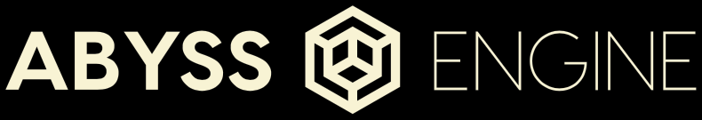

# Abyss Engine

[Join us on Discord!](https://discord.gg/pRy8tdc)\
[Development Live stream](https://www.twitch.tv/essial/)\
[Support us on Patreon](https://www.patreon.com/bePatron?u=37261055)

We are also working on a toolset:\
[https://github.com/OpenDiablo2/HellSpawner](https://github.com/OpenDiablo2/HellSpawner)\
Please consider helping out with this project as well!

## About this project

Abyss Engine is an ARPG game engine in the same vein of the 2000's games, and supports playing games similar to Diablo 2. The engine is written in golang and is cross platform. This engine does not ship with game specific files, and will require a game's assets in order to run.

We are currently working on features necessary to play Diablo 2 in its entirety. After this is completed, we will work on expanding the project to include tools and plugin support for modding, as well as writing completely new games with the engine.

Please note that **this game is neither developed by, nor endorsed by Blizzard or its parent company Activision**.

Diablo 2 and its content is ©2000 Blizzard Entertainment, Inc. All rights reserved. Diablo and Blizzard Entertainment are trademarks or registered trademarks of Blizzard Entertainment, Inc. in the U.S. and/or other countries.

ALL OTHER TRADEMARKS ARE THE PROPERTY OF THEIR RESPECTIVE OWNERS.

## Status

At the moment (december 2020) the game starts, you can select any character and run around Act1 town.
You can also open any of the game's panels.

Much work has been made in the background, but a lot of work still has to be done for the game to be playable.

Feel free to contribute!

## Additional Credits

-   Diablo2 Logo
    -   Jose Pardilla (th3-prophetman)
-   DT1 File Specifications
    -   Paul SIRAMY (http://paul.siramy.free.fr/_divers/dt1_doc/)
-   Other Specifications and general info
    -   Various users on [Phrozen Keep](https://d2mods.info/home.php)
